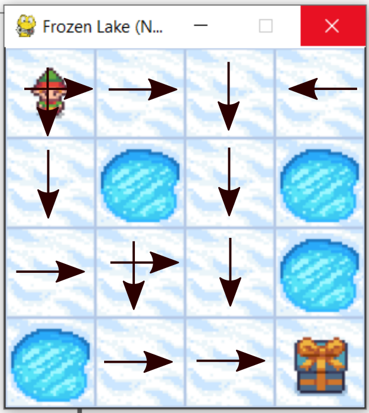

# Frozen Lake


# Description

The game starts with the player at location [0,0] of the frozen lake grid world with the goal located at far extent of the world e.g. [3,3] for the 4x4 environment.

Holes in the ice are distributed in set locations when using a pre-determined map or in random locations when a random map is generated.

The player makes moves until they reach the goal or fall in a hole.

The lake is slippery (unless disabled) so the player may move perpendicular to the intended direction sometimes (see is_slippery).

Randomly generated worlds will always have a path to the goal.


## Action Space

The action shape is (1,) in the range {0, 3} indicating which direction to move the player.

0: Move left

1: Move down

2: Move right

3: Move up

# Observation Space

The observation is a value representing the player’s current position as current_row * nrows + current_col (where both the row and col start at 0).

Observation Space provides exact location of one with respect to rows and cols


# Rewards
Reward schedule:

Reach goal: +1

Reach hole: 0

Reach frozen: 0

# Run demo
- Watch demo : ["Watch Demo"](https://youtu.be/Hf9rCg6Be1Q)
- In order to run demo , you need to do  as the following. This command will save model as .pt extension for later usage. If you want to train model - > frozen_lake.train(3000, is_slippery=is_slippery)
- Once you have model pretrained then put script in test and evaluation mode - >  frozen_lake.test(10, is_slippery=is_slippery)

- In Both cases, you need to run Deep_Frozen_Lake.py file. 

- Script will save inference results to videos folder!
```shell
python3 Deep_Frozen_Lake.py
```


